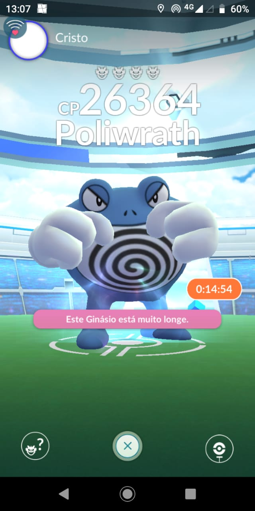

# Data Lovers
É um projeto que tem por finalidade ser uma página web que possa visualizar e manipular dados.

## Índice

* [Resumo do Projeto](#Resumo-do-Projeto)
* [Linguagem de programação](#Linguagem-de-programação)
* [Autoria](#Autoria)
* [Definição do Produto](#Definição-do-produto)
* [Desenho da interface do Usuário](#Desenho-da-interface-do-Usuário)
* [Curiosidades sobre o jogo](#Curiosidades-sobre-o-jogo)
* [Escolhendo seu Pokémon](#Escolhendo-seu-Pokémon)

## Resumo do Projeto
O Data Lovers é um projeto que foi estipulado pela Laboratória com o intuito de desenvolvermos uma página web que visualizasse um conjunto de dados. 
Nossa dupla escolheu o tema <b>Pokemón Go</b>, onde recebemos uma lista com 151 pokemóns da região de Kanto, que continham vários dados sobre cada pokemón, e precisávamos mostrar esses dados na tela de uma forma fácil de entender, e que fosse possível filtrar e ordenar os dados. E fazer algum tipo de cálculo agregado.

## Linguagem de programação
Essa página foi desenvolvida em JavaScript, HTML e Css. Não foi utilizado framework.

## Autoria
O projeto foi desenvolvido pela dupla **Fabiane Albuquerque** e **Vanessa Yoshida**.

## Definição do Produto
1. Persona
A nosso persona é uma **jogadora de Pokémon Go** chamada *Maggie Greene*, tem 27 anos, solteira e adora animes, jogos e seriados. Ela trabalha como projetista de móveis planejados. Desde pequena gostava muito de assistir Pokémon, e quando soube que poderia sair caçando pokémons, ela adorou a idéia e se apaixonou pelo jogo. Além de que ela possui um Nintendo Switch, e descobriu que pode transferir seus pokémons do Pokémon Go para o Nintendo Switch. Agora o problema que ela está tendo é saber qual pokémon usar em uma batalha de Raid, pois precisa saber qual a fraqueza do seu oponente (contra qual tipo ele sofre mais dano). E sabendo o tipo de pokémon que deve usar, precisa saber quais os pokémons precisa usar.

2. Usuários
O nosso público-alvo são jogadores de *Pokémon Go* assim como a Maggie, que *lutam em ginásios ou Raids* e precisam saber qual pokémon usar na batalha.
Chegamos nesse tipo de persona, pois investigamos quais eram as reais necessidades dos jogadores, e descobrimos que existem algumas dificuldades em saber qual pokémon usar contra o oponente. Essa investigação ocorreu por meio de entrevistas com jogares reais.

3. Como funciona o Web Site
* Na primeira seção (que está lado esquerdo) você pode escolher um pokémon e ver os dados dele.
* Na segunda seção (que está no centro) você pode escolher um tipo de pokémon. Nele será apresentado todos os pokémons desse tipo. Você pode ordená-los de A à Z, de Z à A ou por Número da Pokédex. 
* Na terceira seção (que está do lado direito) você pode filtrar os pokémons pela sua fraqueza, por exemplo: Filtrar todos os pokémons que são fracos contra pokémons de água. E dentro dessa seção você também pode ordená-los.
* Como adicional, você também pode vizualizar no botão *Curiosidades* um gráfico que mostra o total de pokémon para cada tipo, e ver qual tipo tem mais pokémons.

4. Benefícios de utilizar o site
Quando você for batalhar em uma Raid, entre no site e veja as informações do pokémon que você vai batalhar. Assim você saberá contra quais tipos ele é fraco.

Você pode filtrar por esse tipo e ver se você tem algum desses pokémons para usar contra o oponente.
E também se você quiser saber quais os pokémons que são fracos contra o seu pokémon, você pode descobrir na seção de fraquezas também.

## Desenho da interface do Usuário
1. Protótipo
Primeiramente fizemos um esboço com lápis e papel, depois passamos a limpo para folhas próprias de esboço com mais detalhes de botões. E para fazer as iterações foi usado fotos desse protótipo no Marvel.
Abaixo estão algumas fotos do protótipo:

Segue o link do Marvel:
[GitHub](http://github.com)

2. Teste de Usabilidade
Com o teste de usabilidade pudemos perceber que as cores não estavam correspondendo as espectativas dos usuários, então tivemos que remodelar as cores. E também descobrimos que seria interessante colocar o total de pokémons apresentados nas telas de tipos e de fraquezas. Mas felizmente não precisaram de grandes alterações, pois planejamos bastante em como deixar o mais fácil possível de vizualizar os dados.

#### Curiosidades sobre o jogo
Batalhas em Pokémon GO acontecem nos Ginásios. Não importa se você está tentando conquistar um ginásio inimigo ou apenas treinando em um ginásio aliado, ou até mesmo lutando em uma Raid. Você precisa saber do básico:
Elas acontecem em tempo real, o que demanda bastante atenção e agilidade. Para lutar, basta tocar na tela de maneira rápida e seu Pokémon atacará, você precisa dar um slide para o lado para que seu Pokémon desvie dos ataques (direita e esquerda). Desviar é fácil de explicar, mas difícil de executar.
Assim que você atacar diversas vezes tocando na tela, você notará que uma barra azul encherá logo abaixo do life do seu Pokémon, aquilo é o golpe especial dele. Ele é bem mais poderoso, mas você precisará segurar a tela para que o Pokémon use o ataque. Vale dizer que neste momento, você será incapaz de desviar dos golpes do inimigo. 

#### Escolhendo seu Pokémon
Pokémon usa o famoso sistema de “pedra, papel e tesoura”, alguns tipos possuem vantagem sobre outros. Um exemplo básico é que água é mais forte contra fogo. Ao desafiar um ginásio, você poderá escolher seis pokémon para a luta. O jogo apontará 6 de cara, mas você pode alterar o time, basta tocar na figura de cada um deles e escolher o substituto.

Porém, se você estiver treinando em um ginásio aliado (um ginásio que possui a mesma cor que seu time), você só poderá jogar com um Pokémon, então escolha o que consegue sofrer mais ataques..

Antes de começar, confira o tipo do Pokémon que está defendendo o Ginásio, confira o seu tipo e o tipo do ataque. Temos como exemplo uma imagem abaixo, mas criamos uma forma de filtrar esses dados de forma mais dinâmica.

As Batalhas Raid são a mais recente funcionalidade do Pokémon Go, funcionalidade essa que foi introduzida com o novo update chamado de Gym Rework.

As Raids juntam os jogadores com o objetivo de derrotar pokémons poderosos com o nome de Raid Bosses - ganhando recompensas exclusivas - assim como a oportunidade de finalmente apanharem os novos Pokémons Lendários.
